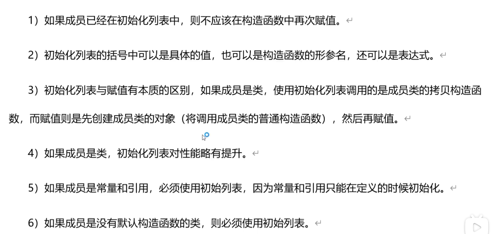

# 类的初始化列表
<p align= center> </p>

# note
> 只有在所有成员变量初始化完成后，构造函数的执行体（即大括号{}内的代码）才会开始执行。

> 安全释放内存，避免重负释放 
> ```c++ 
> delete ptr; // 释放内存  
> ptr = nullptr; // 将ptr设置为nullptr，避免悬挂指针
> ```

>-  移动构造函数  
>>-  移动构造函数接受一个临时对象（右值引用），并“窃取”其资源,随后将原对象的指针设为空，这防止了原对象析构时对相同资源的重复删除.
>>- 让后者（获得该内存使用时间顺序先后）接管前者(原对象)的内存，而取消前者（nullptr）对该内存管理。  
 ```c++   
    // 示例
    Cboy(Cboy&& other) noexcept : name(other.name) {
    other.name = nullptr; // 防止析构时删除
    }
 ```
> 使用std::move显式地告诉编译器boy是一个右值,这允许调用Cboy的移动构造函数，而不是尝试复制。
``` c++
    class Demo {
    public:
    Cboy x_boy;
    // 构造函数，接受Cboy的右值引用
    Demo(Cboy&& boy) : x_boy(std::move(boy)) {
        std::cout << "Demo 使用Cboy的移动构造函数" << std::endl;
    }

    void show() {
        std::cout << "Cboy's name in Demo: " << x_boy.name << std::endl;
    }
}
```
> 在现代C++中，使用= delete来显式禁用类的某些函数是一种常见且有用的做法。这对于管理对象如何被复制或移动尤为重要。具体到拷贝构造函数和拷贝赋值运算符，使用= delete可以阻止编译器自动生成这些函数，从而禁止拷贝操作。这是必要的，尤其是在设计要求独占所有权或管理资源的类时。
```c++
    // 禁用拷贝构造函数和拷贝赋值运算符
    SimpleClass(const SimpleClass&) = delete;
    SimpleClass& operator=(const SimpleClass&) = delete;
```

> p8
>
> error:
>>1. error: cannot bind non-const lvalue reference of type
>>sol: 是临时变量导致的， 可用const 解决，即传递参数采用const

>> 程序崩溃提示：段错误 (核心已转储)

# 友元
> 把一个类中的某个成员函数声明为另一个类的友元
> 要从变量声明顺序以及函数调用顺序来考虑，即要符合逻辑。
```c++ 
// 1.
class demo1;

// 2.
class cboy
{
public:
    // 常量对象只能调用常量成员函数
    void func1(const demo1& d) const;
};

// 3.
// 友元函数是定义在类外部的普通函数，它被赋予了访问类的私有成员（包括私有方法和属性）的权限。
// 友元函数不是类的成员函数，因此它不能通过对象或指针调用，也不通过this指针访问类的实例。
class demo1
{
friend void show(demo1& dd);
friend void cboy::func1(const demo1& d)const;
// friend class cboy;
private:
    string name_;
    int age_;
public:
    demo1(string, int);
    int showage() const
    {
        return age_;
    }
    string showname() const
    {
        return name_; 
    }
};
demo1::demo1(string name,int age): name_(name),age_(age)
{
    cout << "构造函数……\n";
}

// 4.
void cboy::func1(const demo1& d) const { cout << "age1: " << d.age_ <<endl;}

```