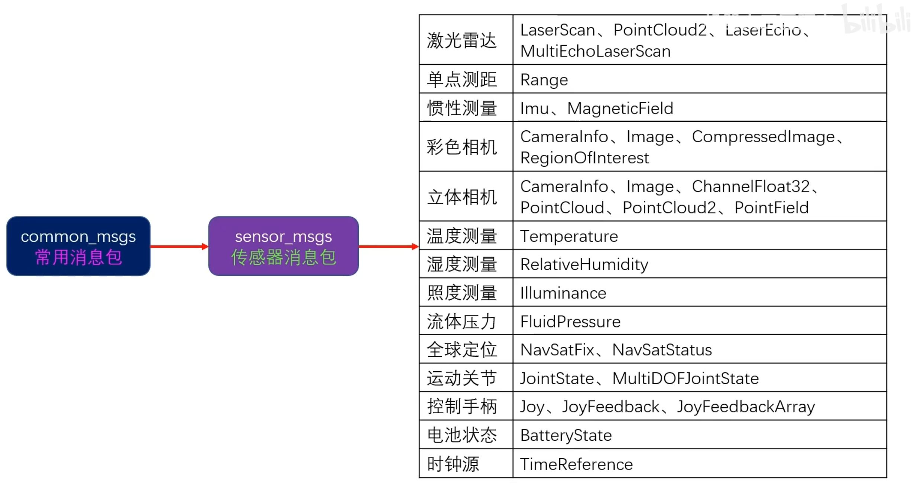

# 四元数 & 欧拉角
 > 四元数描述法通常只在进行旋转变换过程中使用， 旋转后的结果还是转换成欧拉角进行处理

# 消息
> geometry_msgs 关注的是机器人或物体在空间中的位置、姿态和运动状态，主要用于空间几何信息的表示和处理。  
> 用于表示机器人的空间位置、导航、路径规划、坐标变换等方面的信息。(外部/框架)  

> sensor_msgs 专注于从机器人的各种传感器（如摄像头、雷达、IMU等）中接收原始或处理后的数据，用于传感器数据的交换和处理。
> 主要用于从传感器接收数据，并在不同的ROS节点之间共享这些数据，如传感器数据处理、环境感知、目标检测等。（内部）

# 消息包
>1. 标准消息包 std_msgs  (string)
>2. 几何消息包 geometry_msgs  (Twist)
>3. 传感器消息包 sensor_msgs   (LaserScan/Imu_msg)

  

 标准消息包 

  

 常规消息包 
  

> 常用的消息包主要有两个，分别是geometry_msgs 和 sensor_msgs。

  

 几何消息包 

  

 传感器消息包 

>- header 是记录时间戳和坐标系名称的结构体 （stamped）  
>- 运动轨迹消息包（Movelt 机械臂运动规划）
